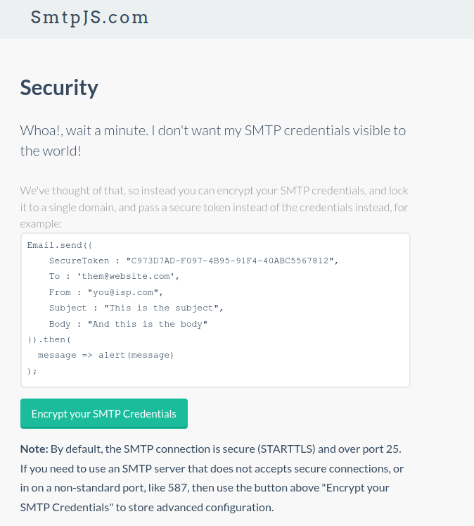
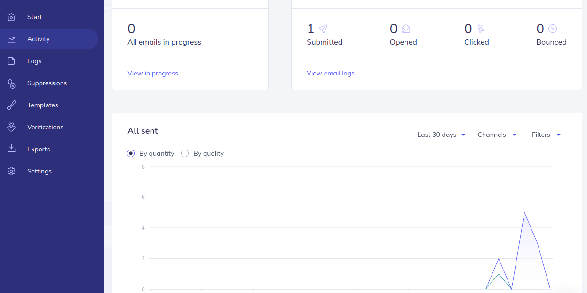

# Trabajo integrador, Curriculum  
 
<h1>Entrega para el trabajo final integrador del curso de frontend de ticmas</h1>

    En esta entrega, se confecciona un curriculum ficticio. 
    (la probabilidad de que alguien se llame pedro gonzagomezlopez presupongo infinitesimal)
    Se utiliza recursos de font awesom y probalbemente algo de bootrap (pero lo minimo).

    En los metadatos se pone un poco de ogg para el face, insta, wsp etc.

    Un poco de media query para hacer el sitio responsivo, para que se vea vien en todos los dispositivos.

    Y se confecciona un formulario de contacto que manda un mail a la casilla de pedro. 
    ( Casilla real creada con la finalidad de usar el formulario).

    Se utiliza un formulario con un boton del tipo button, no submit, para ejecutar un script. 
    Este es contact.js que llama a otro script js en red que conecta a una api.
    La api es proporcionada por el sitio smtpjs (gratuito).
    Como servidor smpt (mail) se utiliza el servicio gratuito de utiliza elasticemail.          

<h1> 
Foto de la pagina en cuestion y el script usado para conectar a la api 
La pagina permite encriptacion de los datos y credenciales del servidor smtp
</h1>

<h1>
La seccion de log en panel de control de  elesticemail y las diferentes pruevas
que se fueron haceiendo hsta que quedo lo mas funcional y claro posible
</h1>    

<h1>
La seccion de actividad en panel de control de  elesticemail y 
el ultimo mail mandado desde la pagina del cv.
</h1>

<h1>
Finalmente el mail enviado a la casilla de pedro. 
</h1>

Completo con un saludo muy grando a quien corrija este trabajo.

Concluyo con un saludo a todo el staff de Ticmas. 

